:icons: font
:sectanchors:
:toc: left
:toclevels: 2
:toc-title: Table of Content
:numbered:
:source-highlighter: highlight.js
= Keycloak Workshop

toc::[]

== Installing the Keycloak Server

 * Grab a server binary link:http://www.keycloak.org/downloads.html[here] (Standalone Server)
 * Unzip it
 * Run it `KC_LOCATION/bin/standalone.sh -Djboss.socket.binding.port-offset=100`

[NOTE]
We run it with a port offset of 100 to make sure we don't conflict with 8080 for the apps we will be deploying.

== Creating the initial Admin user

Browse to `http://localhost:8180/auth` and you will see this screen :

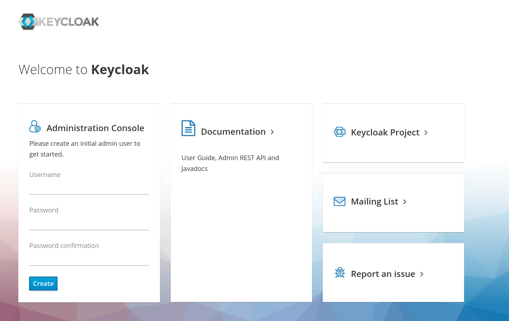

Create a new `admin` user with password `admin`.

Now you can access the Keycloak Web Console

== Configuring a new Realm

A good practice is to create a new Realm but you could keep doing this workshop on the `master` Realm.

You can name the realm as you want, in this workshop I will use `voxxed`

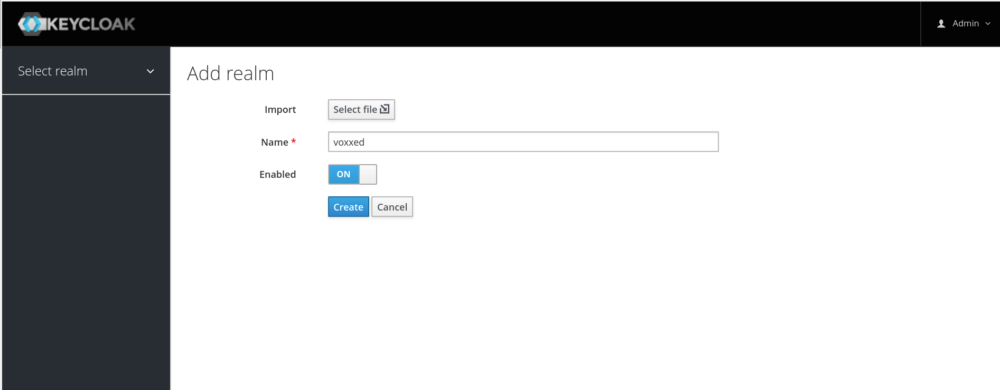

=== Creating the client, the role, and the user

 * Now we need to define a client, which will be our Spring Boot app. Go to the “Clients” section and click the “create” button. We will call our client 'product-app' 

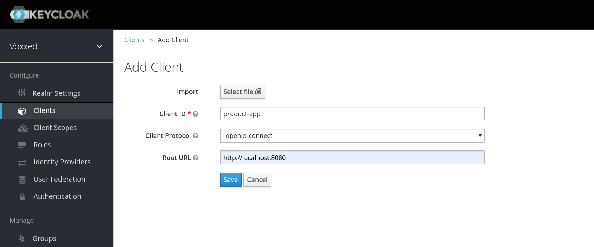

 * On the next screen, we can keep the defaults and save.

[WARNING]
Don't forget to save !

Now, we will define a role that will be assigned to our users, let’s create a simple role called `user` :

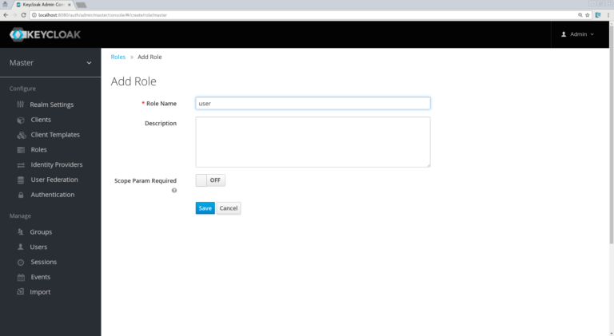

Now, we need to set his credentials, so go to the credentials tab of your user and choose a password, I will be using “password” for the rest of this workshop, make sure to turn off the “Temporary” flag unless you want the user to have to change his password the first time he authenticates.

Finally proceed to the `Role Mappings` tab and assign the role “user” :

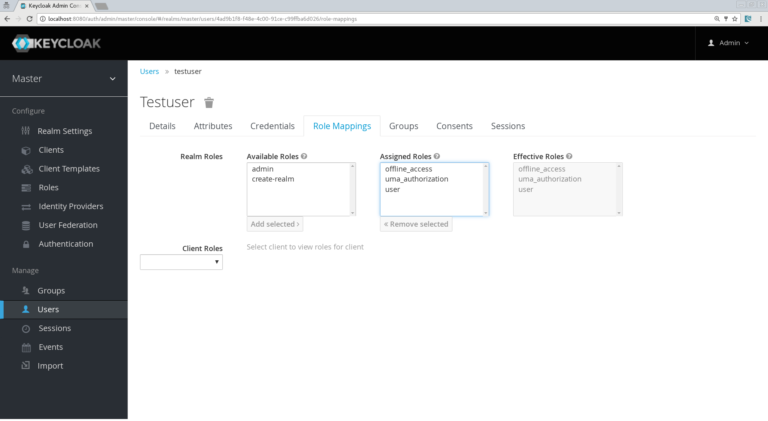

== Running the Spring Boot Product-app

Okay, we are ready to secure our first application, the `product-app` a simple Spring Boot Application using Spring MVC and Freemarker.

And let's create it from scratch !

Browse to link:https://start.spring.io/[The Spring Boot Initialzr] and add the following dependencies :

* Web
* Freemarker

Import the application in your favorite IDE, I will be using IntelliJ.

Let's add one dependency in the `pom.xml` : 

[source, xml]
----

<dependency>
   <groupId>org.keycloak</groupId>
   <artifactId>keycloak-spring-boot-starter</artifactId>
   <version>6.0.1</version>
</dependency>

----

Our app will contain only 2 pages:

* An `index.html` which will be the landing page containing just a link to the product page.
* `products.ftl` which will be our product page template and will be only accessible for authenticated user.

Let’s start by creating in simple `index.html` file in `/src/resources/static`:

[source, html]
----

<html>
<head>
    <title>My awesome landing page</title>
</head>
 <body>
   <h1>Landing page</h1>
   <a href="/products">My products</a>
 </body>
</html>

----

Let's create our Controller and Service classes now

[NOTE]
You can create all the classes (Controller, etc) in the same Main file of your Spring Boot.

[source, java]
----
@Component
class ProductService {
   public List<String> getProducts() {
      return Arrays.asList("iPad","iPod","iPhone");
   }
}

@Controller
class ProductController {

   @Autowired ProductService productService;

   @GetMapping(path = "/products")
   public String getProducts(Model model){
      model.addAttribute("products", productService.getProducts());
      return "products";
   }

   @GetMapping(path = "/logout")
   public String logout(HttpServletRequest request) throws ServletException {
      request.logout();
      return "/";
   }
}

----

The final missing piece before you configure Keycloak is the product template (`products.ftl`), create this file in `sec/resources/templates` :

[source, html]
----

<#import "/spring.ftl" as spring>
<html>
<h1>My products</h1>
<ul>
<#list products as product>
    <li>${product}</li>
</#list>
</ul>

    <a href="/logout">Logout</a>

</html>

----

=== Configuring the Keycloak Adapter

Let's start by adding the mandatory fields :

[source, bash]
----

keycloak.auth-server-url=http://localhost:8180/auth
keycloak.realm=voxxed
keycloak.public-client=true
keycloak.resource=product-app

----

Now, in this same property file, let's add some security constraints :

[source, bash]
----

keycloak.security-constraints[0].authRoles[0]=user
keycloak.security-constraints[0].securityCollections[0].patterns[0]=/products/*

----

Now we can run the app !

[NOTE]
`mvn clean spring-boot:run` or directly from your IDE.

=== The Login Page

Browse to `http://localhost:8080` and click the `products` link, you should be redirected to the Keycloak Login Page.

Login with the user you create in the first step and after Keycloak should redirect you back to your application showing the list of products.

==== Enabling user registration

Click the `logout` link and go back to the Login page.
Let's tweak our Login page using the Keycloak Web Console.

In the `Realm Settings` screen select the `Login` tab :

image::images/loginOptions.png[]

Turn on `User Registration`,  go back to the Login page and refresh.

[NOTE]
You can also "play" with the other options like `Remember me` etc ...

Click the `Register new user` link and fill in the form.

Notice that when you will be redirect to the application you will have an error. That's because you new user don't have the role `user`.

Make sure you add the role to your newly created user and let's also make sure the role user is added by default when an user is created :

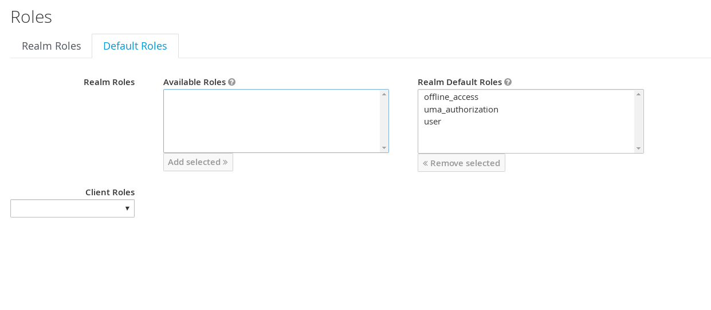

In the Role section, you have a `Default Roles` tab, from there you can choose the default roles.

==== Making the Client Confidential

Since we have a Server Side Application we can make it Confidential to add an extra security.

Go to your Keycloak Web Console and select your `product-app` client and change the `access type` to `confidential` and save.

You will notice now that you have an extra tab `Credentials` , go there are copy your `secret` :

image::images/confidential.png[]

Add this `secret` to your application properties :

[source, bash]
----

keycloak.credentials.secret=your_secret

----

Also remove the property `keycloak.public-client=true`

[NOTE]
Instead of using a `secret` it is also possible to use a signed JWT but this needs a bit more configuration. Check the documentation for more details.

==== Enabling Spring Security

Keycloak has also support for Spring Security and fits perfectly with the Spring Boot Adapter.

Let's start by adding the Spring Security bits :

[source, xml]
----

<dependency>
   <groupId>org.springframework.boot</groupId>
   <artifactId>spring-boot-starter-security</artifactId>
</dependency>

----

===== Creating a SecurityConfig class

Like any other project that is secured with Spring Security, a configuration class extending WebSecurityConfigurerAdapter is needed. Keycloak provides its own subclass that you can again subclass:

[source, java]
----

@KeycloakConfiguration
 class SecurityConfig extends KeycloakWebSecurityConfigurerAdapter
{
   /**
    * Registers the KeycloakAuthenticationProvider with the authentication manager.
    */
   @Autowired
   public void configureGlobal(AuthenticationManagerBuilder auth) throws Exception {
      KeycloakAuthenticationProvider keycloakAuthenticationProvider = keycloakAuthenticationProvider();
      keycloakAuthenticationProvider.setGrantedAuthoritiesMapper(new SimpleAuthorityMapper());
      auth.authenticationProvider(keycloakAuthenticationProvider);
   }

   @Bean
   public KeycloakConfigResolver KeycloakConfigResolver() {
      return new KeycloakSpringBootConfigResolver();
   }

   /**
    * Defines the session authentication strategy.
    */
   @Bean
   @Override
   protected SessionAuthenticationStrategy sessionAuthenticationStrategy() {
      return new RegisterSessionAuthenticationStrategy(new SessionRegistryImpl());
   }

   @Override
   protected void configure(HttpSecurity http) throws Exception
   {
      super.configure(http);
      http
            .authorizeRequests()
            .antMatchers("/products*").hasRole("user")
            .anyRequest().permitAll();
   }

  	@Bean
	@Override
	@ConditionalOnMissingBean(HttpSessionManager.class)
	protected HttpSessionManager httpSessionManager() {
		return new HttpSessionManager();
	}
}

----

In the property file we can now remove the security constraint (all properties that starts with` keycloak.security-constraints`) that we defined since it's Spring Security that handles this now.

Restart the app and it should just work as before.

===== Injecting the Principal

Just like any other app secured with Spring Security you can easily inject the `Principal` in your controller :

[source, java]
----

@GetMapping(path = "/products")
public String getProducts(Principal principal, Model model){
   model.addAttribute("principal",principal);
   model.addAttribute("products", productService.getProducts());
   return "products";
}

----

And add this to your property file :

[source, bash]
----

keycloak.principal-attribute=preferred_username

----

And in your template :

[source, html]
----
<h1>Hello ${principal.getName()}</h1>
----

== Decomposing the monolith

Instead of returning a hard coded product list, let's create a new application that will serve this list.

=== Creating a quarkus app

[source, bash]
----
mvn io.quarkus:quarkus-maven-plugin:0.15.0:create
----

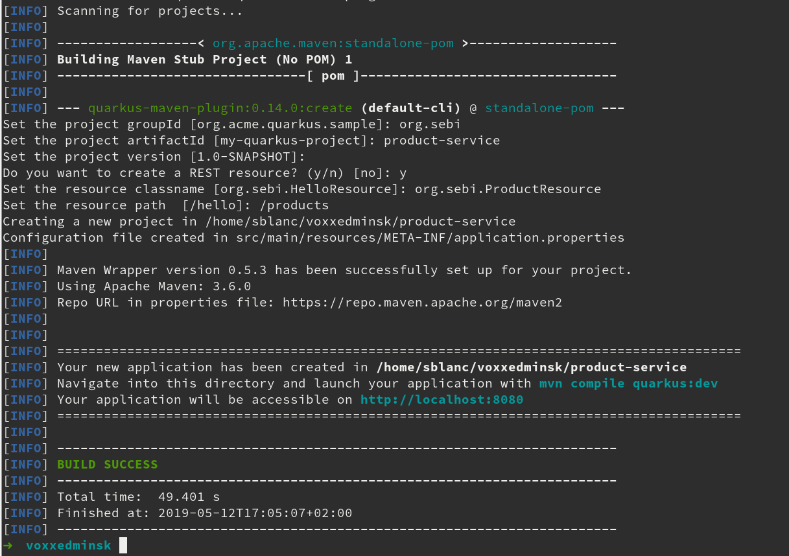

=== Adding the dependencies

Open your Quarkus application and add the following dependencies to your `pom.xml` : 

[source, xml]
----

<dependency>
   <groupId>io.quarkus</groupId>
   <artifactId>quarkus-resteasy-jsonb</artifactId>
</dependency>
<dependency>
   <groupId>io.quarkus</groupId>
   <artifactId>quarkus-keycloak</artifactId>
</dependency>

----

=== Implementing the Rest Endpoint 

[source, java]
----

@Path("/products")
public class ProductResource {

    @GET
    @Produces(MediaType.APPLICATION_JSON)
    @RolesAllowed("user")
    public List<String> hello() {
        return Arrays.asList("Android", "Nokia");
    }
}

----

=== Creating a new Keycloak Client

* Create a new client and call it `product-service` as with root URL `http://localhost:8081`
* In the next screen , in `Access Type` , select `Confidential`
* In the `Credentials` tab copy the `secret` we will need it for the `application.properties`

=== Adding the properties

Go to `src/main/resources/` and open the `application.properties` file : 

[source, bash]
----

quarkus.keycloak.realm=voxxed
quarkus.keycloak.auth-server-url=http://localhost:8180/auth
quarkus.keycloak.resource=product-service
quarkus.keycloak.bearer-only=true
quarkus.keycloak.credentials.secret=secret_of_your_client
quarkus.http.port=8081

----

=== Update the test class 

[source, java]
----

  @Test
    public void testHelloEndpoint() {
        given()
          .when().get("/products")
          .then()
             .statusCode(401);
    }

----

=== Run the product service

[source, bash]
----

mvn clean compile quarkus:dev

----

==== Bonus - Run it as Native 

----

mvn clean package -Pnative
cd target
./product-service-1.0-SNAPSHOT-runner
----

=== Updating the Product App

Now we need to modify our initial application so that it calls the `product-rest` service. We have to make sure it will pass the authorization bearer in the headers.

Luckily, the Keycloak Spring Security Adapter ships a really useful class, the `KeycloakRestTemplate` :

Let's update our Security Config class by adding this :

[source, java]
----

@Autowired
public KeycloakClientRequestFactory keycloakClientRequestFactory;

@Bean
@Scope(ConfigurableBeanFactory.SCOPE_PROTOTYPE)
public KeycloakRestTemplate keycloakRestTemplate() {
  return new KeycloakRestTemplate(keycloakClientRequestFactory);
}

----

Then, we can inject this bean in our service class :

[source, java]
----

@Autowired
private KeycloakRestTemplate template;

public List<String> getProducts() {
  ResponseEntity<String[]> response = template.getForEntity("http://localhost:8081/products", String[].class);
  return Arrays.asList(response.getBody());
}

----

Restart the app and it should just work as before.

== Adding a Web Application

Clone this repo : https://github.com/sebastienblanc/voxxed-apps

Now that we have a separate rest service, we can built a third application that will consume this service.

Let's see how a Pure Web App can be secured with Keycloak and consume a secured rest service.

From the apps repo browse to the `quarkus-front` folder. 

[NOTE]
For convenience, this app has been wrapped inside a Quarkus Application. But you can put this in any Web Server (Apache, Node, etc...)

=== Creating the `product-web` client

Again, we need to create a new client in the Keycloak Web Console with as base URL `http://localhost:8082`.

From the `Installation` tab grab the `keycloak.json` and add it to `src/resources/`

=== Enabling CORS support in the `product-rest` services

Before running our Web Application, we need first to enable CORS support in our `product-service`. We do that by adding a filter :

[source, java]
----

package org.sebi;

import javax.ws.rs.container.ContainerRequestContext;
import javax.ws.rs.container.ContainerResponseContext;
import javax.ws.rs.container.ContainerResponseFilter;
import javax.ws.rs.ext.Provider;
import java.io.IOException;

@Provider
public class CORSFilter implements ContainerResponseFilter {
    @Override
    public void filter(ContainerRequestContext requestContext, ContainerResponseContext responseContext) throws IOException {
        responseContext.getHeaders().add("Access-Control-Allow-Origin", "*");
        responseContext.getHeaders().add("Access-Control-Allow-Headers", "origin, content-type, accept, authorization");
        responseContext.getHeaders().add("Access-Control-Allow-Credentials", "true");
        responseContext.getHeaders().add("Access-Control-Allow-Methods", "GET, POST, PUT, DELETE, OPTIONS, HEAD");
        responseContext.getHeaders().add("Access-Control-Max-Age", "1209600");
    }
}

----

=== Running the Web Application

Running the Web Application can be done with this command : `mvn clean compile quarkus:dev`

Access the Web App : `http://localhost:8082` , note that if you open this in a tab of a browser where you were already connected with the `product-app` you won't need to authenticate ;)

=== Discoveing the user account pages

You might have noticed an `account` button on the web app. 

On this page you cam add some details to your profile but also set up 2FA for instance

=== Adding a new Client Scope

Let's add our avatar url to the token. And let's use a `Client Scope` for this since we might reuse it for other client : 

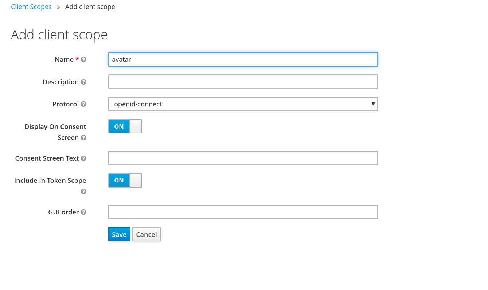

Then create a mapper for this Client Scope :

image::images/avatr2.png[]

And inally add this attrivute to your user : 

image::images/avatar3.png[]

Don't forget to save !

==== adding consent 

Let's add a consent screen : 

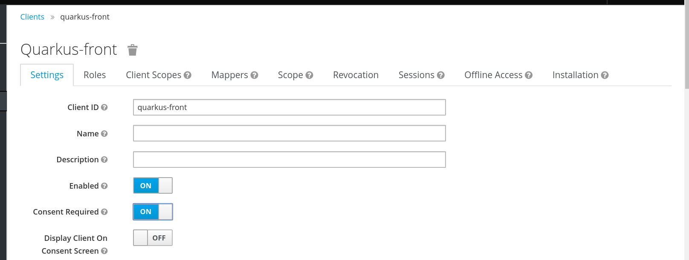

Log out and Log in again !

== Adding a third service with NodeJS

Let's add now a third Microservice, build with NodeJS this time. 

In the app repo, go to `service-nodejs`. 

Install the app : `npm install`

Start the app : `npm start`

=== Adding a REST client to the `product-service`

Start by adding the rest client dependency : 

[source, xml]
----

 <dependency>
   <groupId>io.quarkus</groupId>
   <artifactId>quarkus-smallrye-rest-client</artifactId>
</dependency>

----

Now we define an interface for our client : 

[source, java]
----

package org.sebi;

import org.eclipse.microprofile.rest.client.annotation.RegisterClientHeaders;
import org.eclipse.microprofile.rest.client.inject.RegisterRestClient;
import javax.ws.rs.GET;
import javax.ws.rs.Path;
import javax.ws.rs.Produces;

@Path("/premium/products")
@RegisterRestClient
@RegisterClientHeaders
public interface PremiumService {

    @GET
    @Produces("application/text")
    String getPremium();
}

----

Now we can inject the client in our rest resource : 

[source, java]
----

@Inject
@RestClient
PremiumService premiumService;

----

We update the method for retrieving the products : 

[source, java]
----

@GET
@Produces(MediaType.APPLICATION_JSON)
@RolesAllowed("user")
public List<String> hello() {
   String premiumProduct = premiumService.getPremium();
   return Arrays.asList("Android", "Nokia", premiumProduct);
}

----

And finally we add some configuration to our `application.properties` : 

[source, bash]
-----

org.sebi.PremiumService/mp-rest/url=http://localhost:3000
org.eclipse.microprofile.rest.client.propagateHeaders=Authorization

-----

Notice the second property `propagateHeaders` , this make sure our rest client will reuse the `jwt access token` seamlessly.

Restart `product-service` and use the web app or the `product-app` to call the service again. You should see a new produt coming from the NodeJS service. 

== Adding the Authorization layer (AuthZ)

Until now we have done authentication with some basic RBAC (Role Based Access Control) but Keycloak also comes with a really complete authz layer.

To start, let's move the RBAC from the app to Keycloak.

=== Enabling authorization in Keycloak

Go to the `product-service` and switch the authorization : 

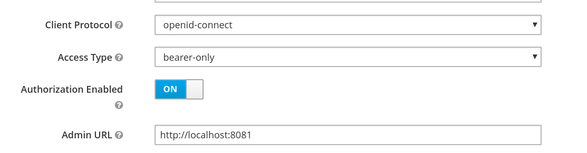

Now go to the `Authorization` tab and hen select `resources`.

=== Creating a new resource

Create a new resource : 

image::images/authz2.png[]

Now create a permission : 

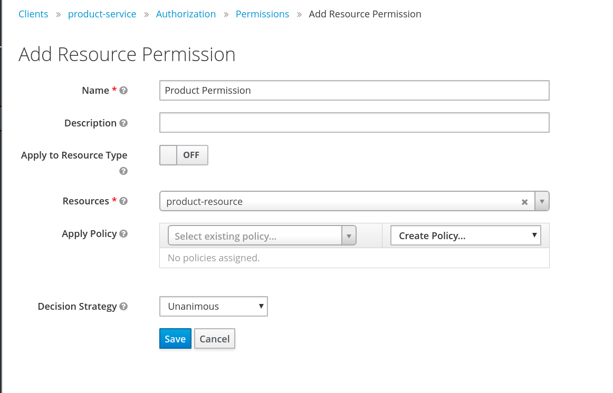

From this same screen, you can also create the new policy of type `role` : 

image::images/authz4.png[]

Save your policy and your permission and you're good on the Keycloak side. 

Last thing to do is to switch your service from `bearer-only` to confidential, also copy your secret for the next step. 

=== Enabling Authz on the service side 

Remove all the keycloak properties from `application.properties` and create a new file in the same folder called `keycloak.json`

[source, javascript]
----

{
  "realm": "voxxed",
  "auth-server-url": "http://localhost:8180/auth",
  "ssl-required": "external",
  "resource": "product-service",
  "credentials": {
    "secret": "you_client_secret"
  },
  "confidential-port": 0,
  "policy-enforcer": {
    "path-cache" : {
      "lifespan" : 0
    }
  },
  "enable-cors" : true
}

----

We can now remove the `@RoleAllowed` annotation from our method since the RBAC is handled on the Keycloak side. 

Try the service, it should just work as before. 

=== Adding a new Role to the policy

To see the power of centralized RBAC, let's create a new realm role , for instance : `superuser` and let's update the policy we created before : 

image::images/rolePolicy.png[]

Log in again with your user, you should not be able to access the service unless you assign the role `superuser` to your user.

=== Adding a Time Policy

You can add a lot of different authorization policies, for instance let's add a policy based on time : 

image::images/timepolicy.png[]

== Limiting th Scope

== The Gatekeeper

